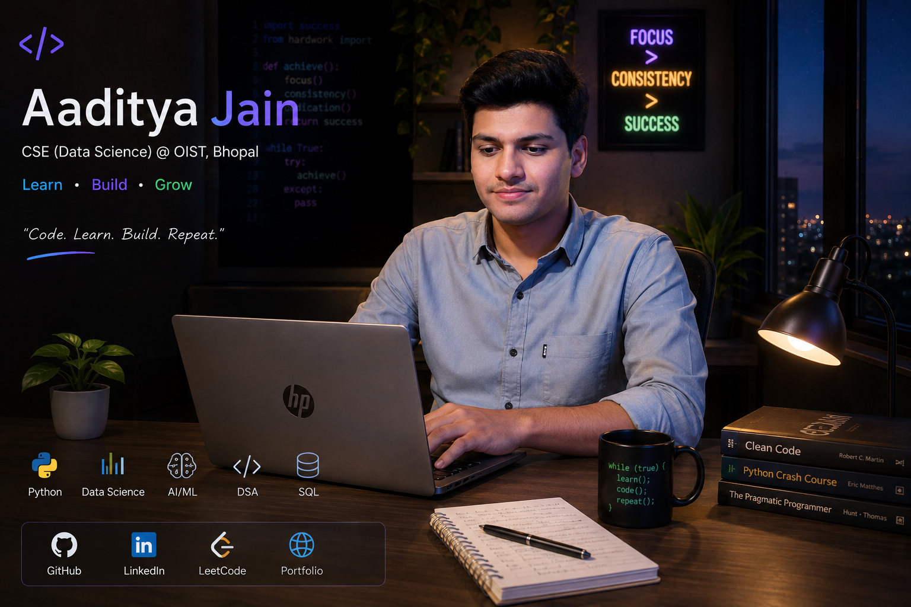

  

# 👋 Hi, I'm Aaditya Jain

### CSE (Data Science) Student • OIST, Bhopal

**Learn • Build • Improve**

 

  

---

## 👨‍💻 About Me

<table>
<tr>

<td width="58%">

### Hi, I'm Aaditya 👋

I'm a CSE (Data Science) student from Bhopal.

I'm currently learning software development, data science,
machine learning and problem solving through regular practice
and projects.

- 🌱 Learning **Python, DSA, Data Science & AI/ML**
- 💻 Practicing **LeetCode**
- 📊 Exploring **Machine Learning**
- 🌐 Learning **Web Development**
- 🤝 Interested in **AI & Data Science projects**

</td>

<td width="42%">

### 🎯 Currently Learning

🐍 **Python & DSA**

Improving problem solving through practice.

📊 **Data Science**

Learning data analysis and ML workflows.

🤖 **AI / ML**

Exploring AI-based projects.

🌐 **Web Development**

Learning frontend and backend technologies.

</td>

</tr>
</table>

---

## 🎯 What I'm Working On

<table>
<tr>

<td align="center" width="33%">

### 🧠 DSA

Solving LeetCode problems and improving problem-solving logic with Python.

</td>

<td align="center" width="33%">

### 🤖 AI / ML

Building small AI and machine learning projects while learning.

</td>

<td align="center" width="33%">

### 📊 Data Science

Exploring data analysis, visualization and machine learning.

</td>

</tr>
</table>

---

## 💻 Tech Stack & Tools

<table>

<tr>
<td><b>🐍 Programming</b></td>
<td>

`Python` `C` `C++` `JavaScript`

</td>
</tr>

<tr>
<td><b>📊 Data Science</b></td>
<td>

`Pandas` `NumPy` `Matplotlib` `Scikit-learn` `Jupyter` `Kaggle`

</td>
</tr>

<tr>
<td><b>🤖 AI / ML</b></td>
<td>

`Machine Learning` `OpenCV` `Generative AI`

</td>
</tr>

<tr>
<td><b>🌐 Web</b></td>
<td>

`HTML` `CSS` `JavaScript` `React` `Flask` `Node.js`

</td>
</tr>

<tr>
<td><b>🗄️ Database</b></td>
<td>

`MySQL` `MongoDB` `Firebase`

</td>
</tr>

<tr>
<td><b>🛠️ Tools</b></td>
<td>

`Git` `GitHub` `VS Code` `Vercel`

</td>
</tr>

</table>

---

## 🚀 Featured Projects

<table>

<tr>

<td width="50%">

### 🤖 First AI Chatbot

A chatbot project built while exploring AI and conversational applications.

**Tech:** `TypeScript` `AI`

<a href="https://github.com/adi03-oist/First-AI-chatbot">
View Repository →
</a>

</td>

<td width="50%">

### 🌦️ Weather API

A web-based weather project using an API to display weather information.

**Tech:** `HTML` `API` `JavaScript`

<a href="https://github.com/adi03-oist/Weather-API">
View Repository →
</a>

</td>

</tr>

<tr>

<td>

### 📄 AI Resume & Job Match Analyzer

AI-powered resume and job description analyzer that identifies matched and missing skills.

**Tech:** `Python` `Streamlit` `AI`

<a href="https://github.com/adi03-oist/AI-resume-and-Job-Match-Analyzer">
View Repository →
</a>

</td>

<td>

### 🔗 Decentralized Funding System

A blockchain-based project exploring decentralized funding.

**Tech:** `Solidity` `Blockchain`

<a href="https://github.com/adi03-oist/decentralized-funding-system">
View Repository →
</a>

</td>

</tr>

<tr>

<td>

### 🌐 Aaditya Portfolio

My personal portfolio website showcasing projects, skills and work.

**Tech:** `HTML` `CSS` `JavaScript`

<a href="https://github.com/adi03-oist/aaditya-portfolio">
View Repository →
</a>

</td>

<td>

### 📚 Smart Library Locator System

A project focused on making library resource/location discovery easier.

**Tech:** `C++`

<a href="https://github.com/adi03-oist/SMART-LIBRARY-LOCATOR-SYSTEM">
View Repository →
</a>

</td>

</tr>

</table>

---

## 🧠 DSA & LeetCode

<table>
<tr>

<td width="70%">

### Consistent Practice

I'm currently solving LeetCode problems using Python and trying to improve my logic rather than just memorizing solutions.

**Practicing**

`Arrays` `Strings` `Hashing` `Two Pointers`

`Sliding Window` `Linked List` `Stack` `Queue`

`Binary Search`

</td>

<td align="center">

</td>

</tr>
</table>

---

## 📊 GitHub Statistics

&nbsp;&nbsp;

---

## 🔥 GitHub Streak

---

## 📈 Contribution Activity

---

## 📜 Certifications

<table>

<tr>

<td width="50%">

### 🐍 NPTEL

**Python for Data Science**

</td>

<td width="50%">

### 🤖 Tata

**GenAI Powered Data Analytics Job Simulation**

</td>

</tr>

<tr>

<td>

### 🚀 HCL GUVI

**Mission Upskill India**

</td>

<td>

### 🧠 Technical Workshops

**Python • Data Science • OpenCV**

</td>

</tr>

</table>

---

## 🤝 Connect With Me

Let's connect, collaborate and learn together 🚀

  

  

### 🚀 Code • Learn • Build • Repeat

